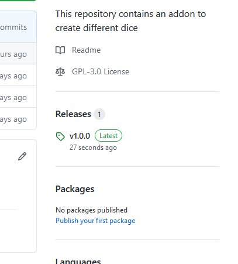
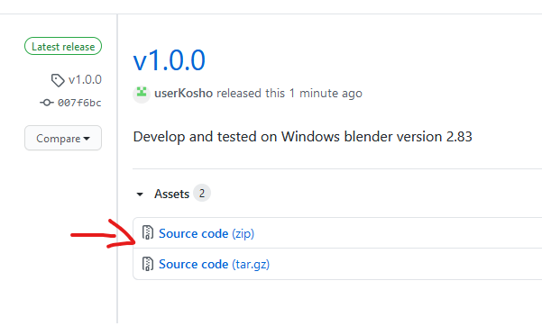
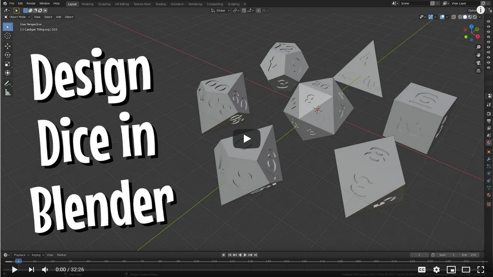
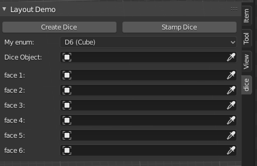

# blender-dice-generator-addon
This repository contains an addon to create different dice with faces 4, 6, 8, 10, 12, 20, 100


The add on automates the process described in a youtube video created by someone else. Link to the video under the Usage section

# Installation

1. Go to release page by clicking on latest release on the right
    
2. Download the release zip source code.
    
3. unzip and locate the folder `dice_generator`
   * (For Windows) copy the folder `dice_generator` into blender's `addons` folder 
   for example:
    ```
    C:\Program Files\Blender Foundation\Blender 2.83\2.83\scripts\addons
    ```
    * (For Mac) Go through the Applications folder and right-click Blender.app for Show Applications Contents
    and copy folder to `addons`
    ```
    /Applications/Blender.app/Contents/Resources/2.83/scripts/addons
    ```
4. In Blender go to add-ons under `Edit->Preferences->Add-ons`
5. click on install and find the `dice_generator` folder and select the `__init__.py` file and click Install Addon
6. In the Search box, search for `Dice Generator` and check the checkbox to enable
7. This plugin requires another plugin to work. Search for `Extra Objects` and enable the plugin

# Usuage
This plugin automates some process shown in this video. Disclaimer, I did not make the video:
[](http://www.youtube.com/watch?v=nCowrvfOr3Q "Design Your Own Custom Dice for Free | Blender Tutorial | DIY with Cly Ep. 21")

The plugin automates the dice creation and stamping process.<br/>
<br/>
<br/>
Use the drop down menu to select which dice you want to make.<br/>
>**Note:** (the plugin remembers the faces and dice set for that  dice even if another option in the drop down is selected. This allows users to work on multiple dice at once)<br/>

Create Dice button will create a blank dice of type selected in the drop down and assign it to `Dice Object`<br/>
Select the object you want to stamp for each side of the face.

# Issues
For immediate suppport
join discord and post in #blender-dice-generator-addon-support
For feature request create an issue or discuss on discord: <br/>
[#dice-support](https://discord.gg/X7faVt8)

# Contribute
This is a side project of mine so development will be slow.
You can contribute and discuss about this plugin on discord: <br/>
[#dice-develop](https://discord.gg/X7faVt8)
